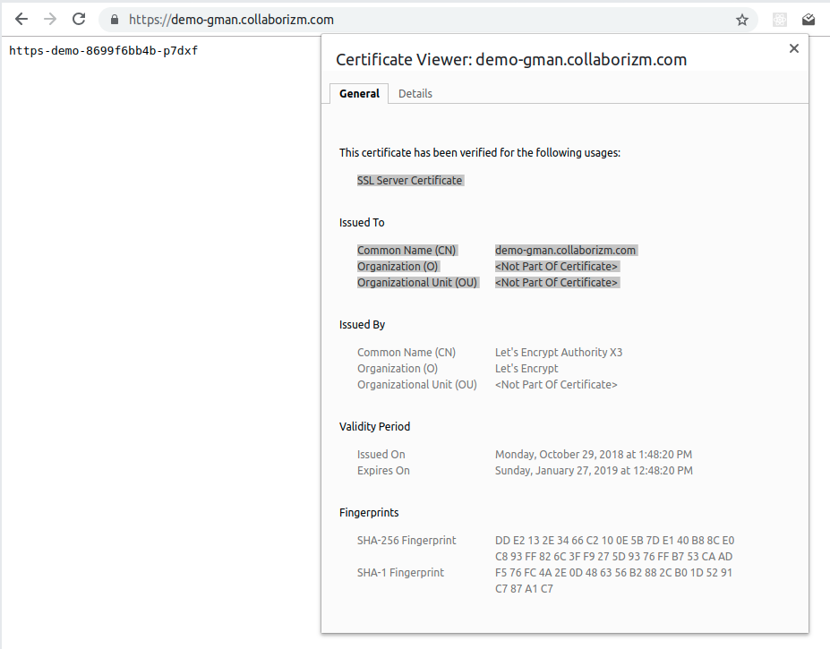

# Using Google Managed  SSL Certificates on GKE  
 
> Special thanks to @dannyzen from Google for helping Collaborizm move to GCP. He did help with this post but neither he nor Google endorse its methods
 
## Getting HTTPS working on GKE can be challenging

Currently there are two main options:

* You can [create certs and add them to your ingress controller](https://cloud.google.com/kubernetes-engine/docs/how-to/ingress-multi-ssl) - 
you'll need to manage your own certs, which seems antiquated post [
Lets Encrypt](https://letsencrypt.org/)        
* Install a certificate provisioning system on your cluster such as [Cert Manager](https://github.com/jetstack/cert-manager) - involves installing extra apps on your cluster, which you'll have to maintain and pay for

There is a third solution: [Google Managed SSL Certs](https://cloud.google.com/load-balancing/docs/ssl-certificates#certificate-resource-status)
 
* They auto renew 
* Offload all SSL handling to Google's Load Balancer (which every GKE cluster uses) 
* Lower infrastructure costs   
 
Downsides:

* In beta and not covered by an SLA
* Use with GKE not fully documented (hence this guide)  
   
**Proceed with caution!!!**

This guide uses an undocumented GKE annotation.
 
 ## Part 1 &middot; Setup a Cluster
 
Create a new GKE project for this to not pollute anything you have in production.
 
Use ```gcloud init``` to create a configuration. 
If you have trouble taming your configurations [check out my other repo](https://github.com/rlancer/GCloud-Configuration-Auto-Switcher), it's a small script to help switch configs based on a .gcloudrc file. 

Clone this repo, we'll be using some YAML from it: 

```bash
git clone git@github.com:rlancer/google-managed-certs-gke.git
cd gke-https
```

Create a Cluster, for this demo the cluster only needs one small node:

```bash
gcloud container clusters create https-demo-cluster --zone us-central1-c --machine-type g1-small --num-nodes 1

# after a few minutes and many warnings you should get a response similar to  

NAME                LOCATION       MASTER_VERSION  MASTER_IP       MACHINE_TYPE   NODE_VERSION  NUM_NODES  STATUS
https-demo-cluster  us-central1-c  1.9.7-gke.6     35.226.141.220  n1-standard-1  1.9.7-gke.6   3          RUNNING
```

Connect Kubectl:

```bash
gcloud container clusters get-credentials https-demo-cluster --zone us-central1-c 

kubeconfig entry generated for https-demo-cluster.
```
Apply configs:  

```bash
kubectl apply -f demo-app.yaml
kubectl apply -f demo-svc.yaml
kubectl apply -f demo-ing.yaml
```

Get the IP address of your Ingress Controller:

```bash
 kubectl get ingress -w 

# Within a few minutes for the IP address should appear 
 
NAME       HOSTS    ADDRESS             PORTS       AGE
demo-ing   *                            80          9s
demo-ing   *        35.241.35.109       80          68s
```

Visit the IP address in your browser, if it doesn't 
show up right away hit refresh, it might take around 10 minutes 
for the app to be fully available.

The app is simply outputting the name of the host it's running 
on.

 


## Part 2 &middot; Hook up the Google Managed Cert 

Create the Google Managed Cert:

```bash
gcloud beta compute ssl-certificates create "demo-gmang-cert" --domains demo-gman.collaborizm.com
```

Get existing URL Maps:

```bash
gcloud compute url-maps list

# You'll need this value when creating the target proxy in the next step

NAME                                       DEFAULT_SERVICE
k8s-um-default-demo-ing--3287e1f664ff7581  backendServices/k8s-be-31012--3287e1f664ff7581
```

Create the HTTPS Target Proxy. Make sure to sub out the --url-map with your value:
```bash
gcloud compute target-https-proxies create https-target --url-map=URL_MAP_VALUE_FROM_ABOVE --ssl-certificates=demo-gmang-cert

Created [https://www.googleapis.com/compute/v1/projects/kube-https-demo/global/targetHttpsProxies/https-target].

NAME          SSL_CERTIFICATES  URL_MAP
https-target  demo-gmang-cert   k8s-um-default-demo-ing--3287e1f664ff7581
```

Create a Global Static IP Address:
```bash
gcloud compute addresses create static-https-ip --global --ip-version IPV4

Created [https://www.googleapis.com/compute/v1/projects/kube-https-demo/global/addresses/static-https-ip].
```

Create a Global Forwarding Rule linking you're newly created IP Address:
```bash
gcloud compute forwarding-rules create https-global-forwarding-rule --global --ip-protocol=TCP --ports=443 --target-https-proxy=https-target --address static-https-ip 
``` 

Adjust the Service to include the Target Proxy, edit demo-svc.yaml to include the target-proxy Annotation: **This is undocumented, could be a bad move...**

```yaml
apiVersion: v1
kind: Service
metadata:
  name: demo-svc
  # Add this annotation
  annotations:
    ingress.kubernetes.io/target-proxy: https-target
spec:
  type: NodePort
  selector:
    run: https-demo
  ports:
  - name: http
    protocol: TCP
    port: 333
    targetPort: 9376
```

Apply the new Service:

```bash
kubectl apply -f demo-svc.yaml
```

Get the IP Address assigned to the Target Proxy:

```bash
gcloud compute addresses list
 
NAME             REGION  ADDRESS        STATUS
static-https-ip          35.227.227.95  IN_USE

```

Create an A Record with the IP Address (on CloudFlare we turned off proxying, hence the gray cloud)


Watch to see if your cert has been provisioned, this could take half an hour: 

```bash
watch gcloud beta compute ssl-certificates list
```

When your cert is active you'll see:

```bash
demo-gmang-cert  MANAGED  2018-10-29T10:47:05.450-07:00  2019-01-27T09:48:20.000-08:00  ACTIVE
    demo-gman.collaborizm.com: ACTIVE
```

Next visit [https://demo-gman.collaborizm.com](https://demo-gman.collaborizm.com) in your browser and you should see your GKE app running with a Google Managed Cert.



## Interested in Google Cloud Platform?

Start or join a project on [Collaborizm](https://www.collaborizm.com)! Our partnership with GCP could net you a few grand in credits. 
